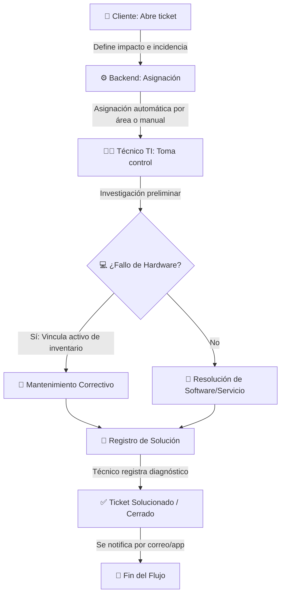

# 🎫 HelpDesk - Plataforma Integral de Soporte, Inventario y KPIs

> Plataforma corporativa Full Stack diseñada para optimizar y centralizar la gestión de soporte técnico (Mesa de Ayuda), control de inventarios de activos de TI, y monitoreo de indicadores operativos y Acuerdos de Nivel de Servicio (SLA) en tiempo real.

HelpDesk es una solución modular desacoplada:
* **Frontend:** SPA interactiva desarrollada con **React**, **TypeScript** y **Tailwind CSS**, empaquetada con **Vite**.
* **Backend:** API REST construida sobre **ASP.NET Core (.NET 10)** y **Entity Framework Core**, utilizando bases de datos relacionales SQL Server y PostgreSQL.

---

## 🎯 ¿Qué Problemas Resuelve HelpDesk?

En las organizaciones medianas y grandes, la infraestructura tecnológica y el soporte técnico suelen sufrir de desorganización. HelpDesk resuelve los siguientes problemas críticos:

1. **Pérdida de Tickets e Incidencias:** Reemplaza los caóticos correos electrónicos y chats informales por un canal centralizado donde cada reporte tiene un identificador único, prioridad y responsable.
2. **Desconexión entre Fallas y Activos:** Asocia directamente las incidencias técnicas con los dispositivos físicos (laptops, servidores, switches). Esto permite responder preguntas clave como: *¿Qué laptops fallan con más frecuencia?* o *¿Qué servidores necesitan mantenimiento correctivo urgente?*
3. **Falta de Trazabilidad e Historial:** Mantiene un registro permanente de todos los cambios de estado en un ticket (`TicketHistory`) y de cada mantenimiento de hardware (`MaintenanceHistory`), evitando perder el conocimiento técnico acumulado.
4. **Incumplimiento de Tiempos de Respuesta (SLA):** Alerta automáticamente a los técnicos cuando un ticket está cerca de vencer y calcula los tiempos de respuesta para asegurar que los problemas críticos del negocio se resuelvan con prioridad.
5. **Falta de Visibilidad Directiva (KPIs):** Ofrece tableros analíticos interactivos sobre el rendimiento del área de soporte para facilitar la toma de decisiones.

---

## ⚙️ ¿Cómo Funciona la Plataforma?

### 1. El Flujo de Gestión de Soporte
El ciclo operativo sigue los estándares de la metodología ITIL/ITSM:



### 2. Gestión de Mantenimiento y Ciclo de Vida del Hardware
El sistema permite dar seguimiento a los dispositivos tecnológicos desde su compra hasta su baja:
* **Mantenimiento Preventivo:** Programación de revisiones periódicas sobre servidores o redes para evitar interrupciones de servicios.
* **Mantenimiento Correctivo:** Disparado de forma reactiva tras la creación de un ticket de soporte.

---

## ✨ Características Técnicas Interesantes y Buenas Prácticas

HelpDesk ha sido construido utilizando estándares de ingeniería modernos, incorporando los siguientes componentes de gran valor técnico:

### 🔄 1. Background Worker Autónomo (`AlertSchedulerWorker`)
* **Uso:** El backend implementa un servicio hospedado en segundo plano (`IHostedService`) en [Program.cs](file:///C:/Users/Usuario/Desktop/Trabajos%20practica/HelpDesk/HelpDeskCode/HelpDeskBE/HelpDesk/Program.cs).
* **Función:** Monitorea de forma asíncrona en la base de datos el cumplimiento de los tiempos de resolución de los tickets. Si detecta un ticket a punto de incumplir las metas de SLA, genera alertas en tiempo real y correos electrónicos automatizados de escalación, liberando la carga de hilos del servidor web.

### 👥 2. Control de Acceso Rol-Based (RBAC) en Múltiples Capas
* **Capa API (C#):** Los endpoints críticos se protegen con políticas JWT mediante el atributo `[Authorize(Roles = "Administrador, TI")]`, denegando llamadas no autorizadas desde el backend a nivel HTTP.
* **Capa Cliente (React):** Rutas administradas por `AppRouter.tsx` que utilizan un componente envolvente `ProtectedRoute.tsx`. Si un cliente intenta ingresar a URLs administrativas como `/dashboard/users` o `/dashboard/logs`, la interfaz deniega el acceso visual e interactivo de inmediato.

### 📝 3. Auditoría y Logs Centralizados (`AuditLog`)
* **Uso:** Cada acción crítica del sistema (cambiar permisos, modificar inventarios, o alterar el estado de un ticket) realiza un volcado automático a una tabla de auditoría con la marca de tiempo, usuario responsable e información del cambio realizado.
* **Acceso:** Exclusivo para administradores a través del módulo de logs para asegurar cumplimiento normativo.

### 📦 4. Generación de Contratos Sincronizados (Orval)
* El frontend automatiza la creación de llamadas HTTP y tipado TypeScript leyendo el esquema JSON de Swagger del Backend mediante **Orval**. Esto evita tener que escribir peticiones de Axios y DTOs manualmente a los desarrolladores, eliminando discrepancias de tipos de datos.

### 💾 5. Relaciones Complejas y Semillero Completo (Seeds)
* Más de 20 seeders independientes configurados en EF Core pueblan la base de datos con organizaciones de prueba, marcas de laptops, fallos de software habituales y configuraciones de alertas pre-armadas para que la aplicación funcione al 100% de manera inmediata al levantarla.

---

## 📂 Estructura General del Repositorio

El proyecto se divide de la siguiente manera:

```text
HelpDesk/
│
├── HelpDesk.BE/              # Backend API (.NET 10)
│   ├── Controllers/          # Endpoints de la API
│   ├── Services/             # Lógica de negocio y Workers en segundo plano
│   ├── Database/             # Modelos de entidades, DbContext y Semilleros (Seeds)
│   ├── Dtos/                 # Estructuras de validación de datos (Input/Output)
│   └── Program.cs            # Inyección de dependencias, CORS, JWT y Middlewares
│
├── HelpDesk.FE/              # Frontend Web (React)
│   └── HelpDeskFETp/
│       ├── src/
│       │   ├── context/      # Estados globales (Autenticación y Sesión)
│       │   ├── routes/       # Rutas y enrutador principal (AppRouter)
│       │   ├── api/          # Clientes de consumo HTTP
│       │   └── feature/      # Módulos por características (Support, Inventory, Admin)
│       └── package.json      # Dependencias de npm y scripts
│
└── README.md                 # Guía principal del proyecto
```

---

## 🛠️ Guía de Inicio Rápido (Levantamiento Local)

Sigue estas instrucciones paso a paso para ejecutar el proyecto en tu máquina local.

### 📋 Prerrequisitos
Asegúrate de contar con las siguientes herramientas instaladas:
* **SDK de .NET 10.0** o superior.
* **Node.js** (Versión 18 o superior) junto con **NPM**.
* Instancia local o remota de **SQL Server** o **PostgreSQL**.
* Consola de comandos (PowerShell / Bash).

---

### 🗄️ Paso 1: Inicializar la Base de Datos y Backend

1. Navega a la carpeta del proyecto backend:
   ```bash
   cd HelpDeskBE/HelpDesk
   ```

2. Configura tu cadena de conexión en el archivo `appsettings.json` (puedes basarte en `appsettings.template.json`):
   ```json
   {
     "ConnectionStrings": {
       "DefaultConnection": "Server=(localdb)\\MSSQLLocalDB;Database=HelpDeskDb;Trusted_Connection=True;MultipleActiveResultSets=true;TrustServerCertificate=True;"
     },
     "AppSettings": {
       "Token": "ClaveSecretaSuperSeguraDeAlMenos32Caracteres"
     }
   }
   ```

3. Instala las herramientas de Entity Framework si no las tienes de manera global:
   ```bash
   dotnet tool install --global dotnet-ef
   ```

4. Aplica las migraciones de base de datos. Esto generará la base de datos, sus tablas y ejecutará los semilleros (*Seeders*) automáticamente:
   ```bash
   dotnet ef database update
   ```

5. Ejecuta la API del Backend:
   ```bash
   dotnet run
   ```
   * La API se levantará en los puertos de desarrollo indicados (típicamente `https://localhost:7196` y `http://localhost:5196`).
   * Puedes ver la consola de pruebas y endpoints de Swagger accediendo a: `https://localhost:7196/swagger`.

---

### 💻 Paso 2: Configurar y Ejecutar el Frontend

1. Abre una nueva ventana de terminal y navega al directorio del cliente React:
   ```bash
   cd HelpDeskFE/HelpDeskFETp
   ```

2. Instala las dependencias y librerías necesarias del proyecto:
   ```bash
   npm install
   ```

3. Crea o edita tu archivo `.env` en la raíz de la carpeta del frontend y define la dirección base del backend:
   ```env
   VITE_API_URL=https://localhost:7196
   ```
   *(Asegúrate de que el puerto coincida exactamente con el expuesto por tu backend)*.

4. Corre la aplicación web en modo de desarrollo local:
   ```bash
   npm run dev
   ```
   * Por defecto, la aplicación web estará disponible en: [http://localhost:5173](http://localhost:5173).

---

### 🔑 Paso 3: Credenciales de Acceso de Prueba (Semilla)
Una vez levantado el frontend y backend, puedes iniciar sesión utilizando la cuenta administrador provista en el semillero:
* **Usuario / Email:** `admin` (o `admin@systemdeluxe.com`)
* **Contraseña:** `Admin1234.`
* **Rol de Acceso:** Administrador (Acceso total)

---

## 📈 Desarrollo y Extensibilidad

### Sincronización Automática de Endpoints
Si realizas modificaciones en los controladores del backend y deseas regenerar los clientes y modelos tipados en el frontend automáticamente, ejecuta en la carpeta del frontend:
```bash
npm run generate-api
```
*(Asegúrate de que la API esté corriendo y de que el archivo `orval.config.ts` apunte a la ruta del Swagger JSON)*.